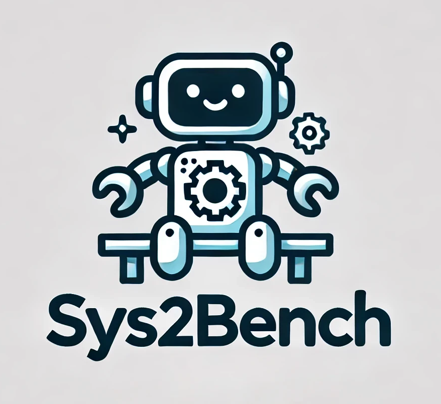

<!-- Improved compatibility of back to top link: See: https://github.com/divelab/Sys2Bench/pull/73 -->
<a id="readme-top"></a>
<!--
*** Thanks for checking out the Best-README-Template. If you have a suggestion
*** that would make this better, please fork the repo and create a pull request
*** or simply open an issue with the tag "enhancement".
*** Don't forget to give the project a star!
*** Thanks again! Now go create something AMAZING! :D
-->


<!-- PROJECT SHIELDS -->
<!--
*** I'm using markdown "reference style" links for readability.
*** Reference links are enclosed in brackets [ ] instead of parentheses ( ).
*** See the bottom of this document for the declaration of the reference variables
*** for contributors-url, forks-url, etc. This is an optional, concise syntax you may use.
*** https://www.markdownguide.org/basic-syntax/#reference-style-links
-->
[![Contributors][contributors-shield]][contributors-url]
[![Forks][forks-shield]][forks-url]
[![Stargazers][stars-shield]][stars-url]
[![Issues][issues-shield]][issues-url]
[![Unlicense License][license-shield]][license-url]
[![LinkedIn][linkedin-shield]][linkedin-url]


<!-- PROJECT LOGO -->
<br />
<div align="center">
  <a href="https://github.com/divelab/sys2bench">
    
  </a>

  <h3 align="center">Sys2Bench</h3>

  <p align="center">
    A curated benchmark evaluating the reasoning and planning abilities of Large Language Models.
    <br />
    <!-- <a href="https://github.com/divelab/sys2bench"><strong>Explore the docs »</strong></a> -->
    <!-- <br />
    <br />
    <a href="https://github.com/divelab/sys2bench">View Demo</a>
    &middot;
    <a href="https://github.com/divelab/Sys2Bench/issues/new?labels=bug&template=bug-report---.md">Report Bug</a>
    &middot;
    <a href="https://github.com/divelab/Sys2Bench/issues/new?labels=enhancement&template=feature-request---.md">Request Feature</a> -->
  </p>
</div>


<!-- TABLE OF CONTENTS -->
<details>
  <summary>Table of Contents</summary>
  <ol>
    <li>
      <a href="#about-the-project">About The Project</a>
    </li>
    <li>
      <a href="#getting-started">Getting Started</a>
      <ul>
        <li><a href="#prerequisites">Prerequisites</a></li>
        <li><a href="#installation">Installation</a></li>
      </ul>
    </li>
    <li><a href="#usage">Usage</a></li>
    <li><a href="#contributing">Contributing</a></li>
    <li><a href="#license">License</a></li>
    <li><a href="#contact">Contact</a></li>
    <li><a href="#acknowledgments">Acknowledgments</a></li>
  </ol>
</details>


<!-- ABOUT THE PROJECT -->
## About The Project

<!-- [![Product Name Screen Shot][product-screenshot]](https://example.com) -->

We examine the reasoning and planning capabilities of large language models (LLMs) in solving complex tasks. Recent advances in inference-time techniques demonstrate the potential to enhance LLM reasoning without additional training by exploring intermediate steps during inference.

Key Contributions:
* We explore how scaling inference-time techniques can improve reasoning and planning, focusing on understanding the tradeoff between computational cost and performance.
* To this end, we construct a comprehensive benchmark, known as **Sys2Bench**, and perform extensive experiments evaluating existing inference-time techniques on eleven diverse tasks across five categories, including arithmetic reasoning, logical reasoning, common sense reasoning, algorithmic reasoning, and planning. 

<p align="right">(<a href="#readme-top">back to top</a>)</p>


### Tasks in Sys2Bench

The table below provides an overview of the 11 datasets included in Sys2Bench, categorized into Algorithmic Reasoning, Planning, Arithmetic Reasoning, Logical Reasoning, and Common Sense Reasoning, along with their respective tasks, inputs, and outputs.

<table>
  <thead>
    <tr>
      <th></th>
      <th colspan="2"><center>Algorithmic Reasoning</center></th>
      <th colspan="4"><center>Planning</center></th>
    </tr>
    <tr>
      <th>Dataset</th>
      <th><center>Game of 24</center></th>
      <th><center>Binpacking</center></th>
      <th><center>Blocksworld</center></th>
      <th><center>Trip Plan</center></th>
      <th><center>Calendar Plan</center></th>
      <th><center>Rubik's Cube</center></th>
    </tr>
  </thead>
  <tbody>
    <tr>
      <td><strong>Task</strong></td>
      <td>Propose an arithmetic expression to reach 24.</td>
      <td>Pack items into the fewest bins.</td>
      <td>Plan actions to transform blocks from initial to goal state.</td>
      <td>Plan a trip across cities for a set number of days.</td>
      <td>Schedule a meeting considering time constraints of people.</td>
      <td>Unscramble a scrambled 2×2 Rubik's Cube.</td>
    </tr>
    <tr>
      <td><strong>Input</strong></td>
      <td>A list of 4 numbers.</td>
      <td>List of item weights and bin capacity.</td>
      <td>Initial state of blocks and goal state.</td>
      <td>Cities, days per city, total days, and possible flights.</td>
      <td>Calendars with meetings and time constraints.</td>
      <td>A scrambled 2×2 Rubik's Cube.</td>
    </tr>
    <tr>
      <td><strong>Output</strong></td>
      <td>An arithmetic expression.</td>
      <td>Final list with items arranged in bins.</td>
      <td>A sequence of actions as the plan.</td>
      <td>A trip itinerary.</td>
      <td>A meeting time fitting all schedules.</td>
      <td>A sequence of rotations that unscramble the cube.</td>
    </tr>
  </tbody>
</table>

<table>
  <thead>
    <tr>
      <th></th>
      <th colspan="2"><center>Arithmetic Reasoning</center></th>
      <th><center>Logical Reasoning</center></th>
      <th colspan="2"><center>Common Sense Reasoning</center></th>
    </tr>
    <tr>
      <th>Task</th>
      <th><center>GSM8K</center></th>
      <th><center>AQuA</center></th>
      <th><center>ProntoQA</center></th>
      <th><center>StrategyQA</center></th>
      <th><center>HotPotQA</center></th>
    </tr>
  </thead>
  <tbody>
    <tr>
      <td><strong>Task</strong></td>
      <td>Solve high school arithmetic problems.</td>
      <td>Solve algebraic problems.</td>
      <td>Draw a logical conclusion from a set of predicates.</td>
      <td>Answer general knowledge questions.</td>
      <td>Answer general knowledge questions using provided facts.</td>
    </tr>
    <tr>
      <td><strong>Input</strong></td>
      <td>Arithmetic problem description.</td>
      <td>Algebraic problem description.</td>
      <td>A clause to verify as true or false using logical predicates.</td>
      <td>A yes/no question.</td>
      <td>General knowledge question with supporting facts.</td>
    </tr>
    <tr>
      <td><strong>Output</strong></td>
      <td>A numerical value.</td>
      <td>A multiple-choice option.</td>
      <td>True or False, and reasoning.</td>
      <td>Yes or No.</td>
      <td>Short answer of 1 or 2 words.</td>
    </tr>
  </tbody>
</table>


<!-- GETTING STARTED -->
## Getting Started

Follow the steps below to set up the repository and start using it.

### Prerequisites

Before using this repository, ensure you have the following installed:
* Conda or Miniconda - <a href="https://docs.anaconda.com/miniconda/install/"> Installation Guide </a> 
* Python >= 3.10
* CUDA >= 12.0
  
You can install Miniconda with Python 3.10 or later on Linux using:
```
wget https://repo.anaconda.com/miniconda/Miniconda3-latest-Linux-x86_64.sh -O ~/miniconda.sh
bash ~/miniconda.sh -b -p $HOME/miniconda3
$HOME/miniconda3/bin/conda init
source ~/.bashrc 
```

**API Keys**

To use OpenAI's models, you need an API Key. We also use DeepInfra for running LLaMa models, but this is optional since these models can be run locally as well.
* OpenAI API Key (Required)
  - Sign up or login at <a href='https://platform.openai.com/signup/'> OpenAI </a>
  - Navigate to API keys and create a new key.
* Export the API key (Linux)
    ```sh
    export OPENAI_API_KEY="your-api-key"
    echo 'export OPENAI_API_KEY="your-api-key-here"' >> ~/.bashrc
    source ~/.bashrc
    ``` 
* The same can be done for <a href='https://deepinfra.com/'> DeepInfra </a> as well, if you do make sure to export the token `export DEEPINFRA_TOKEN='your token here'` same way as OpenAI.

### Installation

To make the installation easy, we provide a step by step instruction of how to setup our repo and get started.

1. Clone the repo
   ```sh
   git clone https://github.com/divelab/sys2bench.git
   ```
2. Set Python Path
   ```sh
   export PYTHONPATH=/path/to/repo/sys2bench:$PYTHONPATH
   ```
3. Run `setup.sh`, this file takes care of conda environment installation, and environment variables.

<p align="right">(<a href="#readme-top">back to top</a>)</p>


<!-- USAGE EXAMPLES -->
## Usage  

This section explains how to run all experiments at once or execute specific methods individually, either via shell scripts or Python.

### Running the Complete Sys2Bench Suite  
To run all experiments in one go, execute the `sys2bench.sh` script. This will automatically run all experiments together:  

```sh
bash sys2bench.sh
```

### Running Specific Methods via Shell Scripts  
If you prefer to run specific methods, each method has a corresponding shell script that outlines the necessary arguments. You can simply execute these scripts from the terminal for a quick setup.  

Example: Running **Chain of Thought (CoT)** on the **GSM8K** dataset:  
```sh
bash methods/CoT/gsm8k/cot.sh
```

### Running Specific Methods via Python  
Alternatively, you can run each method by passing the required arguments to the `inference.py` script associated with the dataset and method. This approach allows customization of parameters for experimentation.  

Example: Running **Tree of Thoughts (ToT)** on the **Game 24** dataset:  
```sh
python methods/ToT/game24/inference.py --base_lm openai --n_beam 5 --depth_limit 4 --openai_model gpt-4o-mini
```

Feel free to tweak the arguments to experiment with different configurations! 🚀


<!-- ROADMAP -->
<!-- ## Roadmap

- [x] Add Changelog
- [x] Add back to top links
- [ ] Add Additional Templates w/ Examples
- [ ] Add "components" document to easily copy & paste sections of the readme
- [ ] Multi-language Support
    - [ ] Chinese
    - [ ] Spanish

See the [open issues](https://github.com/divelab/Sys2Bench/issues) for a full list of proposed features (and known issues).

<p align="right">(<a href="#readme-top">back to top</a>)</p> -->


<!-- CONTRIBUTING -->
## Contributing

Contributions are what make the open source community such an amazing place to learn, inspire, and create. Any contributions you make are **greatly appreciated**.

If you have a suggestion that would make this better, please fork the repo and create a pull request. You can also simply open an issue with the tag "enhancement".
Don't forget to give the project a star! Thanks again!

1. Fork the Project
2. Create your Feature Branch (`git checkout -b feature/AmazingFeature`)
3. Commit your Changes (`git commit -m 'Add some AmazingFeature'`)
4. Push to the Branch (`git push origin feature/AmazingFeature`)
5. Open a Pull Request

<!-- LICENSE -->
## License

Distributed under the Apache-2.0 License. See `LICENSE` for more information.

<p align="right">(<a href="#readme-top">back to top</a>)</p>


<!-- CONTACT -->
## Contact

- Shubham Parashar - shubhamprshr@tamu.edu

- Blake Olson - blakeolson@tamu.edu

- Eric Li - draydere@tamu.edu

- Hongyi Ling - hongyiling@tamu.edu

<p align="right">(<a href="#readme-top">back to top</a>)</p>


<!-- ACKNOWLEDGMENTS -->
## Acknowledgments

This work was supported in part by **National Institutes of Health** under grant **U01AG070112** and **National Science Foundation** under grant **CNS-2328395**. 

We also acknowledge previous contributions from [maitrix-org/llm-reasoners](https://github.com/maitrix-org/llm-reasoners) and [karthikv792/LLMs-Planning](https://github.com/karthikv792/LLMs-Planning). Additionally, we appreciate the [Awesome ReadMe Template](https://github.com/othneildrew/Best-README-Template/tree/main) for providing a clean and structured README design.

## Citation

If you found our work useful, please considering citing our preprint - "Inference-Time Computations for LLM Reasoning and Planning: A Benchmark and Insights"

```
@misc{parashar2025inferencetimecomputationsllmreasoning,
      title={Inference-Time Computations for LLM Reasoning and Planning: A Benchmark and Insights}, 
      author={Shubham Parashar and Blake Olson and Sambhav Khurana and Eric Li and Hongyi Ling and James Caverlee and Shuiwang Ji},
      year={2025},
      eprint={2502.12521},
      archivePrefix={arXiv},
      primaryClass={cs.AI},
      url={https://arxiv.org/abs/2502.12521}, 
}
```
<!-- MARKDOWN LINKS & IMAGES -->
<!-- https://www.markdownguide.org/basic-syntax/#reference-style-links -->
[contributors-shield]: https://img.shields.io/github/contributors/divelab/sys2bench.svg?style=for-the-badge
[contributors-url]: https://github.com/divelab/Sys2Bench/graphs/contributors
[forks-shield]: https://img.shields.io/github/forks/divelab/sys2bench.svg?style=for-the-badge
[forks-url]: https://github.com/divelab/Sys2Bench/network/members
[stars-shield]: https://img.shields.io/github/stars/divelab/sys2bench.svg?style=for-the-badge
[stars-url]: https://github.com/divelab/Sys2Bench/stargazers
[issues-shield]: https://img.shields.io/github/issues/divelab/sys2bench.svg?style=for-the-badge
[issues-url]: https://github.com/divelab/Sys2Bench/issues
[license-shield]: https://img.shields.io/github/license/divelab/sys2bench.svg?style=for-the-badge
[license-url]: https://github.com/divelab/Sys2Bench/blob/master/LICENSE
[linkedin-shield]: https://img.shields.io/badge/-LinkedIn-black.svg?style=for-the-badge&logo=linkedin&colorB=555
[linkedin-url]: https://www.linkedin.com/in/shubhamprshr/
