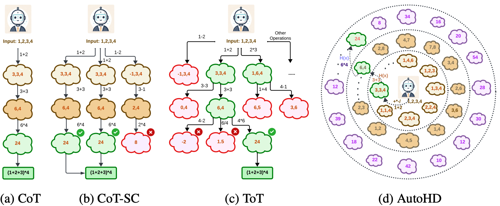

<!-- Improved compatibility of back to top link: See: https://github.com/divelab/Sys2Bench/pull/73 -->
<a id="readme-top"></a>
<!--
*** Thanks for checking out the Best-README-Template. If you have a suggestion
*** that would make this better, please fork the repo and create a pull request
*** or simply open an issue with the tag "enhancement".
*** Don't forget to give the project a star!
*** Thanks again! Now go create something AMAZING! :D
-->


<!-- PROJECT SHIELDS -->
<!--
*** I'm using markdown "reference style" links for readability.
*** Reference links are enclosed in brackets [ ] instead of parentheses ( ).
*** See the bottom of this document for the declaration of the reference variables
*** for contributors-url, forks-url, etc. This is an optional, concise syntax you may use.
*** https://www.markdownguide.org/basic-syntax/#reference-style-links
-->
<!-- [![Contributors][contributors-shield]][contributors-url]
[![Forks][forks-shield]][forks-url]
[![Stargazers][stars-shield]][stars-url]
[![Issues][issues-shield]][issues-url]
[![Unlicense License][license-shield]][license-url]
[![LinkedIn][linkedin-shield]][linkedin-url] -->


<!-- PROJECT LOGO -->
<br />
<div align="center">

  <h3 align="center">Complex LLM Planning via Automated Heuristics Discovery</h3>

  

</div>


<!-- TABLE OF CONTENTS -->
<!-- <details>
  <summary>Table of Contents</summary>
  <ol>
    <li>
      <a href="#about-the-project">About The Project</a>
    </li>
    <li>
      <a href="#getting-started">Getting Started</a>
      <ul>
        <li><a href="#prerequisites">Prerequisites</a></li>
        <li><a href="#installation">Installation</a></li>
      </ul>
    </li>
    <li><a href="#usage">Usage</a></li>
    <li><a href="#contributing">Contributing</a></li>
    <li><a href="#license">License</a></li>
    <li><a href="#contact">Contact</a></li>
    <li><a href="#acknowledgments">Acknowledgments</a></li>
  </ol>
</details> -->

## Abstract
We consider enhancing large language models (LLMs) for complex planning tasks. While existing methods allow LLMs to explore intermediate steps to make plans, they either depend on unreliable self-verification or external verifiers to evaluate these steps, which demand significant data and computations. 
Here, we propose automated heuristics discovery (AutoHD), a novel approach that enables LLMs to explicitly generate heuristic functions to guide inference-time search, allowing accurate evaluation of intermediate states. These heuristic functions are further refined through a heuristic evolution process, improving their robustness and effectiveness. Our proposed method requires no additional model training or fine-tuning, and the explicit definition of heuristic functions generated by the LLMs provides interpretability and insights into the reasoning process. Extensive experiments across diverse benchmarks demonstrate significant gains over multiple baselines, including nearly twice the accuracy on some datasets, establishing our approach as a reliable and interpretable solution for complex planning tasks.


<!-- USAGE EXAMPLES -->
## Usage  

### Getting Started

Please follow the instructions of Sys2Bench to set up the environment and start using it.

### Running Blocksworld

To run AutoHD with the heuristic evolution process, please use the following command:

```sh
python methods/AutoHD/blocksworld/heuristic_search.py --temperature 0.8 --base_lm openai --openai_model gpt-4o-mini
```
If you only want to perform heuristic-guided inference-time search, run:

```sh
python methods/AutoHD/blocksworld/inference.py --heuristic_log_file methods/AutoHD/blocksworld/bw_HeuristicSearch-4o-mini.log --temperature 0.8 --base_lm openai --openai_model gpt-4o-mini
```
Additionally, we provide a script for convenience: `methods/AutoHD/blocksworld/autohd.sh`. 

### Running Game of 24

To run AutoHD with the heuristic evolution process, please use the following command:

```sh
python methods/AutoHD/game24/heuristic_search.py --temperature 0.8 --base_lm openai --openai_model gpt-4o-mini
```
If you only want to perform heuristic-guided inference-time search, run:

```sh
python methods/AutoHD/game24/inference.py --heuristic_log_file methods/AutoHD/game24/gam24_HeuristicSearch_5gen-openai-gpt4o-mini.log --temperature 0.8 --base_lm openai --openai_model gpt-4o-mini
```
Additionally, we provide a script for convenience: `methods/AutoHD/game24/autohd.sh`. 

### Running Rubik's Cube

To run AutoHD with the heuristic evolution process, please use the following command:

```sh
python methods/AutoHD/rubikscube/heuristic_search.py --temperature 0.8 --base_lm openai --openai_model gpt-4o-mini
```
If you only want to perform heuristic-guided inference-time search, run:

```sh
python methods/AutoHD/rubikscube/inference.py --heuristic_log_file methods/AutoHD/rubikscube/cube_HeuristicSearch_openai_gpt4o-mini.log 
```
Additionally, we provide a script for convenience: `methods/AutoHD/rubikscube/autohd.sh`. 

Feel free to tweak the arguments to experiment with different configurations! 🚀

<p align="right">(<a href="#readme-top">back to top</a>)</p>


<!-- ROADMAP -->
<!-- ## Roadmap

- [x] Add Changelog
- [x] Add back to top links
- [ ] Add Additional Templates w/ Examples
- [ ] Add "components" document to easily copy & paste sections of the readme
- [ ] Multi-language Support
    - [ ] Chinese
    - [ ] Spanish

See the [open issues](https://github.com/divelab/Sys2Bench/issues) for a full list of proposed features (and known issues).

<p align="right">(<a href="#readme-top">back to top</a>)</p> -->


<!-- LICENSE -->
## License

Distributed under the Apache-2.0 License. See `LICENSE` for more information.

<p align="right">(<a href="#readme-top">back to top</a>)</p>


<!-- CONTACT -->
## Contact

- Shubham Parashar - shubhamprshr@tamu.edu

- Hongyi Ling - hongyiling@tamu.edu

<p align="right">(<a href="#readme-top">back to top</a>)</p>


<!-- ACKNOWLEDGMENTS -->
## Acknowledgments

This work was supported in part by National Science Foundation under grant CNS-2328395 and National Institutes of Health under grant U01AG070112.

<!-- ## Citation

If you found our work useful, please considering citing our preprint - "Inference-Time Computations for LLM Reasoning and Planning: A Benchmark and Insights"

```
@misc{2025Sys2BenchLLM,
      title={Inference-Time Computations for LLM Reasoning and Planning: A Benchmark and Insights}, 
      author={Shubham Parashar and Blake Olson and Sambhav Khurana and Eric Li and Hongyi Ling and James Caverlee and Shuiwang Ji},
      year={2025},
      eprint={2502.12521},
      archivePrefix={arXiv},
      primaryClass={cs.AI},
      url={https://arxiv.org/abs/2502.12521}, 
}
``` -->
<!-- MARKDOWN LINKS & IMAGES -->
<!-- https://www.markdownguide.org/basic-syntax/#reference-style-links -->
<!-- [contributors-shield]: https://img.shields.io/github/contributors/divelab/sys2bench.svg?style=for-the-badge
[contributors-url]: https://github.com/divelab/Sys2Bench/graphs/contributors
[forks-shield]: https://img.shields.io/github/forks/divelab/sys2bench.svg?style=for-the-badge
[forks-url]: https://github.com/divelab/Sys2Bench/network/members
[stars-shield]: https://img.shields.io/github/stars/divelab/sys2bench.svg?style=for-the-badge
[stars-url]: https://github.com/divelab/Sys2Bench/stargazers
[issues-shield]: https://img.shields.io/github/issues/divelab/sys2bench.svg?style=for-the-badge
[issues-url]: https://github.com/divelab/Sys2Bench/issues
[license-shield]: https://img.shields.io/github/license/divelab/sys2bench.svg?style=for-the-badge
[license-url]: https://github.com/divelab/Sys2Bench/blob/master/LICENSE
[linkedin-shield]: https://img.shields.io/badge/-LinkedIn-black.svg?style=for-the-badge&logo=linkedin&colorB=555
[linkedin-url]: https://www.linkedin.com/in/shubhamprshr/ -->
